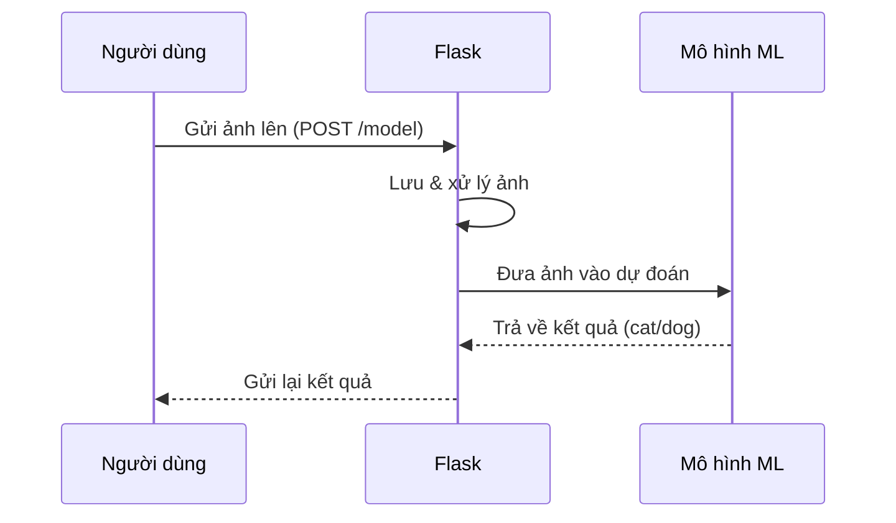

# Chapter 1: Ứng dụng Flask phục vụ dự đoán mèo/chó


## Động lực: Làm sao để máy tính biết đây là mèo hay chó?

Hãy tưởng tượng bạn có một bức ảnh và muốn hỏi máy tính: "Đây là mèo hay chó vậy?" Thay vì phải tự đoán, bạn chỉ cần gửi ảnh lên một ứng dụng web, và chỉ sau vài giây, bạn nhận được câu trả lời ngay: "Đây là mèo!" hoặc "Đây là chó!". Đó chính là nhiệm vụ của **Ứng dụng Flask phục vụ dự đoán mèo/chó** trong dự án này.

Ứng dụng này giống như một quầy tiếp tân: bạn đưa ảnh vào, nhân viên (máy tính) kiểm tra, hỏi ý kiến chuyên gia (mô hình học máy), rồi trả lời bạn kết quả. Nếu có sự cố, nhân viên sẽ báo lại lỗi cho bạn.

## Các khái niệm chính

Để hiểu rõ hơn, chúng ta sẽ chia nhỏ thành các phần đơn giản:

1. **Nhận ảnh từ người dùng:** Ứng dụng nhận file ảnh mà bạn tải lên.
2. **Lưu và xử lý ảnh:** Ứng dụng lưu ảnh lại, chỉnh kích thước cho phù hợp với mô hình.
3. **Dự đoán bằng mô hình học máy:** Ảnh được đưa vào mô hình đã huấn luyện để phân loại là mèo hay chó.
4. **Trả về kết quả:** Ứng dụng gửi lại cho bạn kết quả dự đoán.
5. **Xử lý lỗi:** Nếu có vấn đề (ví dụ: file không hợp lệ), ứng dụng sẽ báo lỗi.

## Sử dụng ứng dụng Flask để giải quyết bài toán

### Quy trình sử dụng

1. Bạn truy cập vào địa chỉ của ứng dụng (ví dụ: http://localhost:6040).
2. Bạn gửi một file ảnh (có thể dùng công cụ như Postman hoặc một giao diện web đơn giản).
3. Ứng dụng nhận ảnh, xử lý và trả về kết quả là "cat" (mèo) hoặc "dog" (chó).

### Ví dụ minh họa

**Giả sử bạn gửi lên ảnh tên là `meo1.jpg`.**

- **Đầu vào:** File ảnh `meo1.jpg`
- **Đầu ra:** Chuỗi `"cat"` (nếu là mèo) hoặc `"dog"` (nếu là chó)

### Đoạn mã đơn giản nhận ảnh và trả về kết quả

```python
from flask import Flask, request

app = Flask(__name__)

@app.route('/model', methods=['POST'])
def index():
    image = request.files['file']  # Nhận file ảnh từ người dùng
    # ... (xử lý ảnh và dự đoán)
    return "cat"  # hoặc "dog"
```

**Giải thích:**  
Đoạn mã trên tạo một API nhận file ảnh từ người dùng qua phương thức POST. Sau khi xử lý, nó trả về kết quả là "cat" hoặc "dog".

## Bên trong ứng dụng Flask: Chuyện gì xảy ra?

Hãy cùng hình dung quy trình bên trong giống như một dây chuyền kiểm tra ảnh:



**Giải thích:**  
- Người dùng gửi ảnh lên.
- Flask nhận ảnh, lưu lại, chỉnh kích thước.
- Ảnh được đưa vào mô hình học máy (ML) để dự đoán.
- Kết quả trả về cho Flask, rồi Flask gửi lại cho người dùng.

## Phân tích mã nguồn thực tế

### 1. Nhận và lưu ảnh

```python
image = request.files['file']
path_to_save = os.path.join(app.config['UPLOAD_FOLDER'], image.filename)
image.save(path_to_save)
```

**Giải thích:**  
- `request.files['file']`: Lấy file ảnh từ người dùng.
- `image.save(...)`: Lưu file ảnh vào thư mục chỉ định.

### 2. Xử lý ảnh trước khi dự đoán

```python
frame = cv2.imread(path_to_save)
frame = cv2.resize(frame, dsize=(150,150))
frame = np.expand_dims(frame, axis=0)
```

**Giải thích:**  
- Đọc ảnh vừa lưu.
- Đổi kích thước ảnh về 150x150 pixel (phù hợp với mô hình).
- Thêm chiều batch để phù hợp với đầu vào của mô hình.

### 3. Dự đoán và trả về kết quả

```python
prediction_prob = model.predict(frame)[0][0]
if prediction_prob < 0.5:
    output = "cat"
else:
    output = "dog"
return output
```

**Giải thích:**  
- `model.predict(frame)`: Đưa ảnh vào mô hình để dự đoán.
- Nếu xác suất nhỏ hơn 0.5, trả về "cat", ngược lại trả về "dog".

### 4. Xử lý lỗi

```python
except Exception as ex:
    return "Error: " + str(ex)
```

**Giải thích:**  
Nếu có lỗi xảy ra (ví dụ: file không hợp lệ), ứng dụng sẽ trả về thông báo lỗi.

## Tổng kết

Qua chương này, bạn đã hiểu được cách một ứng dụng Flask có thể nhận ảnh, xử lý và dự đoán đó là mèo hay chó. Ứng dụng này là trung tâm giao tiếp giữa người dùng và mô hình học máy, giúp mọi người dễ dàng kiểm tra ảnh chỉ với vài thao tác đơn giản.

Ở chương tiếp theo, chúng ta sẽ tìm hiểu sâu hơn về "bộ não" phía sau – chính là mô hình học máy phân loại mèo/chó. Hãy cùng khám phá tiếp tại: [Mô hình học máy phân loại mèo/chó](02_mô_hình_học_máy_phân_loại_mèo_chó_.md)

