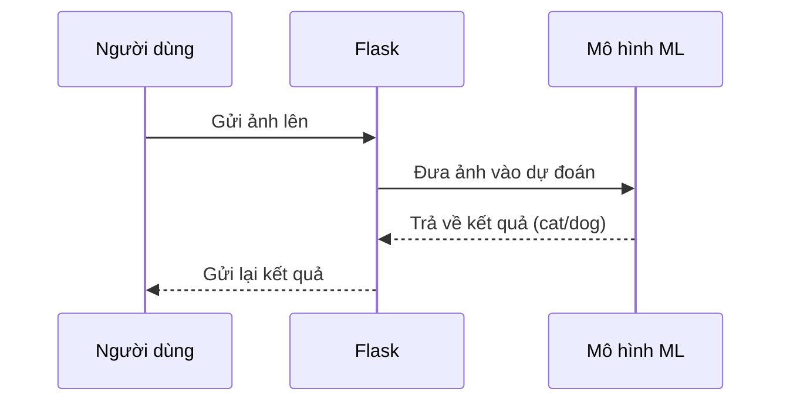

# Chapter 2: Mô hình học máy phân loại mèo/chó


Ở [Chương 1: Ứng dụng Flask phục vụ dự đoán mèo/chó](01_ứng_dụng_flask_phục_vụ_dự_đoán_mèo_chó_.md), bạn đã biết cách một ứng dụng web nhận ảnh từ người dùng và trả về kết quả là mèo hay chó. Nhưng bạn có bao giờ tự hỏi: **Làm sao máy tính biết được đâu là mèo, đâu là chó?** Bí mật nằm ở "bộ não" của hệ thống – **mô hình học máy phân loại mèo/chó**!

---

## Động lực: Máy tính phân biệt mèo và chó như thế nào?

Hãy tưởng tượng bạn đưa cho một chuyên gia hàng trăm bức ảnh mèo và chó. Sau một thời gian, chuyên gia này sẽ học được cách phân biệt hai loài vật này chỉ bằng cách nhìn vào ảnh. Mô hình học máy cũng giống như vậy: nó được "dạy" bằng rất nhiều ảnh mèo và chó, sau đó lưu lại "kinh nghiệm" vào một file (ví dụ: `cat_dog_classifier.hdf5`). Khi nhận được ảnh mới, nó sẽ phân tích và dự đoán đó là mèo hay chó.

**Trường hợp sử dụng thực tế:**  
Bạn tải lên một ảnh bất kỳ, ví dụ `cho1.jpg`. Mô hình sẽ xem xét các đặc điểm trên ảnh (tai, mũi, lông, v.v.), tính toán và trả về xác suất đó là chó hay mèo.

---

## Các khái niệm chính về mô hình học máy

Để dễ hiểu, hãy chia nhỏ mô hình học máy thành các phần đơn giản:

### 1. Mô hình học máy là gì?

- **Mô hình học máy** giống như một chuyên gia đã được huấn luyện để nhận diện mèo và chó qua ảnh.
- Sau khi được huấn luyện, mô hình sẽ được lưu lại thành một file (`cat_dog_classifier.hdf5`).

### 2. Huấn luyện mô hình

- Đầu tiên, mô hình được "dạy" bằng hàng ngàn bức ảnh mèo và chó.
- Nó học cách nhận biết các đặc điểm khác nhau giữa hai loài này.

### 3. Dự đoán với mô hình

- Khi nhận được một ảnh mới, mô hình sẽ phân tích và đưa ra xác suất đó là mèo hay chó.
- Nếu xác suất < 0.5, dự đoán là "cat" (mèo); nếu ≥ 0.5, dự đoán là "dog" (chó).

---

## Sử dụng mô hình để phân loại ảnh

### Quy trình sử dụng

1. **Nạp mô hình:** Đầu tiên, ứng dụng sẽ nạp file mô hình đã được huấn luyện.
2. **Xử lý ảnh:** Ảnh được chỉnh kích thước và chuyển đổi cho phù hợp với mô hình.
3. **Dự đoán:** Ảnh được đưa vào mô hình để dự đoán kết quả.

### Ví dụ minh họa

**Đầu vào:** Ảnh `meo2.jpg`  
**Đầu ra:** Chuỗi `"cat"` (nếu là mèo) hoặc `"dog"` (nếu là chó)

---

### Đoạn mã ví dụ: Nạp mô hình và dự đoán

#### 1. Nạp mô hình đã huấn luyện

```python
from keras.models import load_model

model = load_model("models/cat_dog_classifier.hdf5")
```

**Giải thích:**  
Dòng lệnh này sẽ nạp mô hình đã được huấn luyện từ file `cat_dog_classifier.hdf5` để sẵn sàng sử dụng cho việc dự đoán.

#### 2. Xử lý ảnh đầu vào

```python
import cv2
import numpy as np

frame = cv2.imread("meo2.jpg")
frame = cv2.resize(frame, (150, 150))
frame = np.expand_dims(frame, axis=0)
```

**Giải thích:**  
- Đọc ảnh từ file.
- Đổi kích thước ảnh về 150x150 pixel (phù hợp với mô hình).
- Thêm chiều batch để phù hợp với đầu vào của mô hình.

#### 3. Dự đoán kết quả

```python
prediction_prob = model.predict(frame)[0][0]
if prediction_prob < 0.5:
    output = "cat"
else:
    output = "dog"
```

**Giải thích:**  
- Dự đoán xác suất ảnh là chó.
- Nếu xác suất nhỏ hơn 0.5, kết quả là "cat" (mèo); ngược lại là "dog" (chó).

---

## Bên trong mô hình: Chuyện gì xảy ra khi dự đoán?

Hãy hình dung quá trình này như một dây chuyền kiểm tra ảnh:



**Giải thích:**  
- Người dùng gửi ảnh lên ứng dụng Flask.
- Flask chuyển ảnh cho mô hình học máy.
- Mô hình phân tích và trả về kết quả là mèo hay chó.
- Flask gửi kết quả lại cho người dùng.

---

## Phân tích mã nguồn thực tế

### 1. Nạp mô hình trong ứng dụng Flask

**File:** `Docker/api.py`

```python
from keras.models import load_model

model = load_model("models/cat_dog_classifier.hdf5")
```

**Giải thích:**  
Ứng dụng Flask sẽ nạp mô hình ngay khi khởi động, sẵn sàng cho việc dự đoán.

### 2. Xử lý ảnh và dự đoán

```python
frame = cv2.imread(path_to_save)
frame = cv2.resize(frame, (150, 150))
frame = np.expand_dims(frame, axis=0)
prediction_prob = model.predict(frame)[0][0]
```

**Giải thích:**  
- Đọc ảnh vừa lưu từ người dùng.
- Đổi kích thước ảnh.
- Chuyển đổi thành dạng phù hợp cho mô hình.
- Dự đoán xác suất ảnh là chó.

### 3. Xét kết quả và trả về

```python
if prediction_prob < 0.5:
    output = "cat"
else:
    output = "dog"
return output
```

**Giải thích:**  
- Nếu xác suất nhỏ hơn 0.5, trả về "cat".
- Ngược lại, trả về "dog".

---

## Tóm tắt

Qua chương này, bạn đã hiểu về **mô hình học máy phân loại mèo/chó** – bộ não giúp máy tính phân biệt hai loài vật này chỉ qua ảnh. Mô hình này được huấn luyện, lưu lại dưới dạng file, và được ứng dụng Flask sử dụng để trả về kết quả dự đoán cho người dùng.

Ở chương tiếp theo, bạn sẽ học cách đóng gói toàn bộ hệ thống này và triển khai dễ dàng bằng Docker. Hãy tiếp tục khám phá tại: [Hệ thống đóng gói và triển khai với Docker](03_hệ_thống_đóng_gói_và_triển_khai_với_docker_.md)

