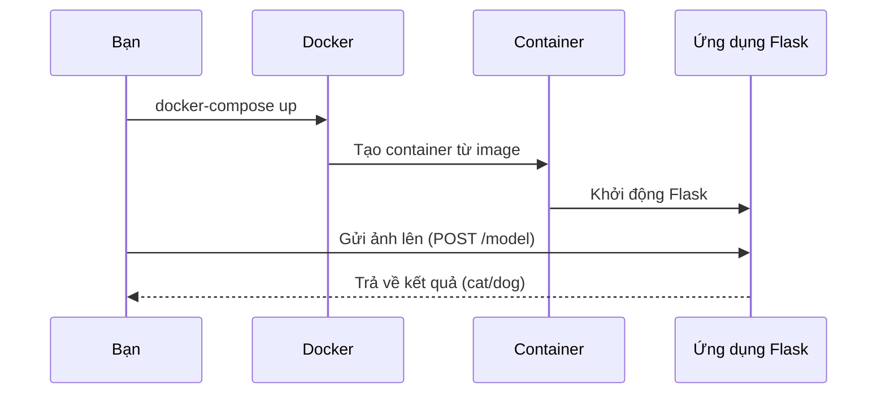

# Chapter 3: Hệ thống đóng gói và triển khai với Docker


Ở [Chương 2: Mô hình học máy phân loại mèo/chó](02_mô_hình_học_máy_phân_loại_mèo_chó_.md), bạn đã biết cách máy tính sử dụng mô hình học máy để phân biệt mèo và chó qua ảnh. Nhưng nếu bạn muốn chia sẻ ứng dụng này cho bạn bè, hoặc chạy nó trên một máy tính khác, bạn sẽ gặp phải rất nhiều rắc rối: thiếu thư viện, sai phiên bản Python, lỗi môi trường... Vậy làm sao để đóng gói toàn bộ ứng dụng thành một "chiếc hộp" có thể mang đi bất cứ đâu và chạy được ngay lập tức?

Đó chính là lý do chúng ta cần đến **Docker**!

---

## Động lực: Tại sao cần đóng gói và triển khai với Docker?

Hãy tưởng tượng bạn chuẩn bị đi du lịch và muốn mang theo mọi thứ cần thiết: quần áo, bàn chải, sạc điện thoại... Nếu bạn chỉ cầm từng món lẻ tẻ, rất dễ quên hoặc thiếu thứ gì đó. Nhưng nếu bạn bỏ tất cả vào một chiếc vali, bạn chỉ cần xách vali lên là đi được ngay!

Ứng dụng cũng vậy: nếu chỉ copy từng file mã nguồn, mô hình, thư viện... sang máy khác, rất dễ gặp lỗi. Docker giúp bạn "đóng gói" toàn bộ ứng dụng, thư viện, môi trường vào một **container** – giống như một chiếc vali chứa đủ mọi thứ cần thiết. Bạn chỉ cần mang container này đi đâu cũng chạy được, không lo thiếu sót.

---

## Các khái niệm chính về Docker

Để dễ hiểu, hãy chia nhỏ thành các phần đơn giản:

### 1. Docker là gì?

- **Docker** là một công cụ giúp đóng gói ứng dụng và môi trường chạy vào một "container" (hộp chứa).
- Container này có thể chạy trên bất kỳ máy tính nào có cài Docker, không cần quan tâm hệ điều hành, thư viện, hay phiên bản Python.

### 2. Dockerfile là gì?

- **Dockerfile** giống như một công thức nấu ăn: ghi lại từng bước để tạo ra container.
- Bạn chỉ cần viết ra các bước cài đặt thư viện, copy mã nguồn, cấu hình môi trường... Docker sẽ tự động làm theo.

### 3. docker-compose.yaml là gì?

- **docker-compose.yaml** giống như một danh sách hướng dẫn: giúp bạn khởi động, dừng, và quản lý nhiều container cùng lúc (hoặc chỉ một container cho đơn giản).
- Bạn chỉ cần chạy một lệnh duy nhất, Docker sẽ tự động dựng lên toàn bộ hệ thống.

---

## Quy trình đóng gói và triển khai ứng dụng với Docker

### Bài toán thực tế

**Bạn muốn chạy ứng dụng dự đoán mèo/chó trên bất kỳ máy tính nào chỉ với một lệnh duy nhất, không cần cài đặt gì thêm.**

### Các bước thực hiện

1. **Viết Dockerfile** để hướng dẫn Docker cách đóng gói ứng dụng.
2. **Viết docker-compose.yaml** để quản lý việc chạy container.
3. **Xây dựng (build) container** từ Dockerfile.
4. **Chạy ứng dụng** bằng Docker.

---

### 1. Viết Dockerfile

**File:** `Docker/Dockerfile`

```dockerfile
FROM ubuntu:latest

WORKDIR /app

RUN apt-get update -y
RUN apt-get install -y python3-pip python3-dev build-essential hdf5-tools libgl1 libgtk2.0-dev

COPY ./requirements.txt /app/requirements.txt
RUN pip3 install -r requirements.txt

COPY . /app

EXPOSE 6040

CMD ["python3", "api.py"]
```

**Giải thích từng dòng:**

- `FROM ubuntu:latest`: Bắt đầu từ hệ điều hành Ubuntu mới nhất.
- `WORKDIR /app`: Đặt thư mục làm việc là `/app`.
- `RUN ...`: Cài đặt các phần mềm cần thiết (Python, pip, thư viện hỗ trợ).
- `COPY ...`: Copy file `requirements.txt` và toàn bộ mã nguồn vào container.
- `RUN pip3 install -r requirements.txt`: Cài đặt các thư viện Python cần thiết.
- `EXPOSE 6040`: Mở cổng 6040 để ứng dụng Flask có thể nhận kết nối.
- `CMD ["python3", "api.py"]`: Khi container khởi động, chạy file `api.py` (ứng dụng Flask).

**Tóm lại:**  
Dockerfile giống như một công thức giúp Docker tự động tạo ra một môi trường hoàn chỉnh để chạy ứng dụng của bạn.

---

### 2. Viết docker-compose.yaml

**File:** `docker-compose.yaml`

```yaml
version: "3.8"

services:
  Docker:
    image: demo
    container_name: demo_c
    ports:
      - 3000:6040
    working_dir: /app
    volumes:
      - ./Docker:/app
```

**Giải thích:**

- `services`: Định nghĩa các dịch vụ (ở đây chỉ có một dịch vụ tên là Docker).
- `image: demo`: Tên image sẽ được build từ Dockerfile.
- `container_name: demo_c`: Đặt tên cho container là `demo_c`.
- `ports: 3000:6040`: Chuyển cổng 6040 trong container ra cổng 3000 trên máy thật (bạn sẽ truy cập ứng dụng qua http://localhost:3000).
- `working_dir: /app`: Thư mục làm việc trong container.
- `volumes`: Gắn thư mục mã nguồn từ máy thật vào container (giúp dễ chỉnh sửa).

**Tóm lại:**  
docker-compose.yaml giúp bạn quản lý việc chạy container dễ dàng chỉ với một lệnh.

---

### 3. Xây dựng và chạy ứng dụng với Docker

#### a. Xây dựng image từ Dockerfile

```bash
docker build -t demo ./Docker
```

**Giải thích:**  
- `docker build`: Lệnh xây dựng image Docker.
- `-t demo`: Đặt tên image là `demo`.
- `./Docker`: Thư mục chứa Dockerfile.

#### b. Khởi động container với docker-compose

```bash
docker-compose up
```

**Giải thích:**  
- Lệnh này sẽ đọc file `docker-compose.yaml` và tự động khởi động container.
- Ứng dụng Flask sẽ chạy bên trong container, sẵn sàng nhận ảnh để dự đoán mèo/chó.

---

## Ví dụ minh họa: Đóng gói và chạy ứng dụng dự đoán mèo/chó

**Quy trình sử dụng:**

1. Bạn viết xong mã nguồn Flask và mô hình học máy.
2. Bạn tạo `Dockerfile` và `docker-compose.yaml` như hướng dẫn ở trên.
3. Bạn chạy các lệnh:

```bash
docker build -t demo ./Docker
docker-compose up
```

4. Ứng dụng sẽ chạy trên http://localhost:3000. Bạn có thể gửi ảnh lên để dự đoán mèo/chó mà không cần cài đặt thêm gì cả!

---

## Bên trong Docker: Chuyện gì xảy ra khi bạn chạy ứng dụng?

Hãy hình dung quá trình này như một dây chuyền tự động đóng gói và vận chuyển:



**Giải thích:**  
- Bạn chỉ cần chạy một lệnh, Docker sẽ tự động dựng lên toàn bộ môi trường.
- Ứng dụng Flask chạy bên trong container, sẵn sàng phục vụ bạn.
- Bạn gửi ảnh lên, nhận kết quả dự đoán mà không lo thiếu thư viện hay lỗi môi trường.

---

## Phân tích mã nguồn thực tế

### 1. Dockerfile – Công thức đóng gói

**File:** `Docker/Dockerfile`

```dockerfile
COPY ./requirements.txt /app/requirements.txt
RUN pip3 install -r requirements.txt
```

**Giải thích:**  
- Copy file chứa danh sách thư viện Python vào container.
- Cài đặt tất cả thư viện cần thiết chỉ với một dòng lệnh.

### 2. docker-compose.yaml – Quản lý container

**File:** `docker-compose.yaml`

```yaml
ports:
  - 3000:6040
```

**Giải thích:**  
- Chuyển cổng 6040 (bên trong container) ra cổng 3000 (bên ngoài máy tính của bạn).
- Bạn chỉ cần truy cập http://localhost:3000 là có thể sử dụng ứng dụng.

### 3. CMD trong Dockerfile – Khởi động ứng dụng

```dockerfile
CMD ["python3", "api.py"]
```

**Giải thích:**  
- Khi container khởi động, tự động chạy file `api.py` (ứng dụng Flask).

---

## Tổng kết

Qua chương này, bạn đã học cách đóng gói toàn bộ ứng dụng dự đoán mèo/chó vào một "chiếc hộp" Docker. Nhờ đó, bạn có thể mang ứng dụng đi bất cứ đâu, chạy trên bất kỳ máy tính nào mà không lo thiếu thư viện hay lỗi môi trường. Docker giúp việc triển khai ứng dụng trở nên đơn giản, nhanh chóng và chuyên nghiệp hơn rất nhiều.

Chúc mừng bạn đã hoàn thành phần quan trọng này!  
Bạn có thể quay lại ôn tập các chương trước hoặc tiếp tục phát triển, mở rộng ứng dụng của mình.

---

Nếu bạn muốn tìm hiểu lại về mô hình học máy phía sau ứng dụng, hãy xem lại: [Mô hình học máy phân loại mèo/chó](02_mô_hình_học_máy_phân_loại_mèo_chó_.md)

Chúc bạn học tốt và khám phá thêm nhiều điều thú vị với Docker! 🚀

