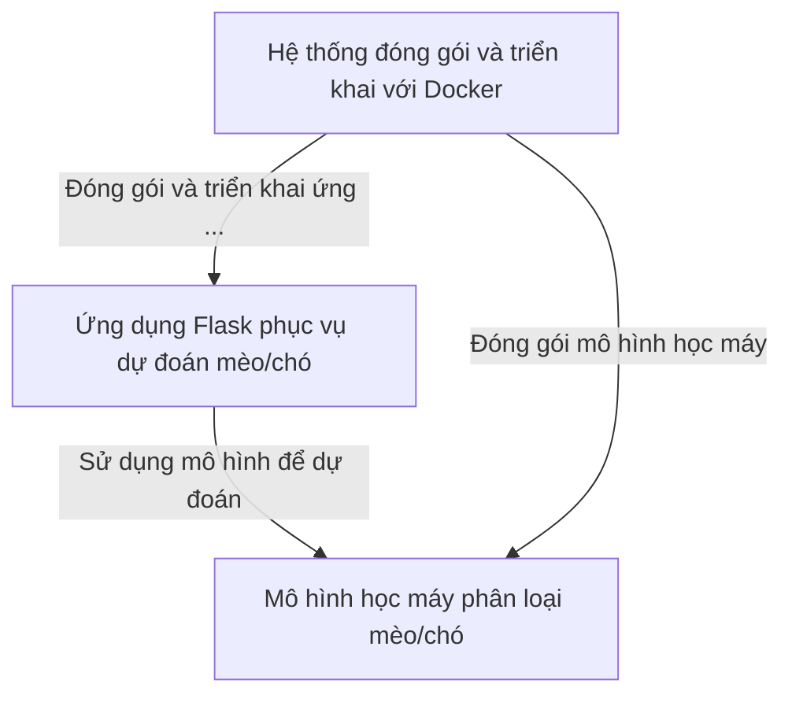

# Documentation: DemoDocker

**DemoDocker** là một dự án giúp bạn dễ dàng nhận diện *mèo* hay *chó* từ hình ảnh bằng cách sử dụng **Flask** kết hợp với *mô hình học máy* đã huấn luyện sẵn. Ứng dụng được đóng gói hoàn chỉnh bằng **Docker**, giúp bạn triển khai và chạy ở bất kỳ đâu mà không cần lo lắng về môi trường hay thư viện phụ thuộc. Chỉ cần gửi một bức ảnh, hệ thống sẽ trả về kết quả là *mèo* hay *chó* một cách nhanh chóng và tiện lợi.

## Chapters

1. [Ứng dụng Flask phục vụ dự đoán mèo/chó
](01_ứng_dụng_flask_phục_vụ_dự_đoán_mèo_chó_.md)
2. [Mô hình học máy phân loại mèo/chó
](02_mô_hình_học_máy_phân_loại_mèo_chó_.md)
3. [Hệ thống đóng gói và triển khai với Docker
](03_hệ_thống_đóng_gói_và_triển_khai_với_docker_.md)
