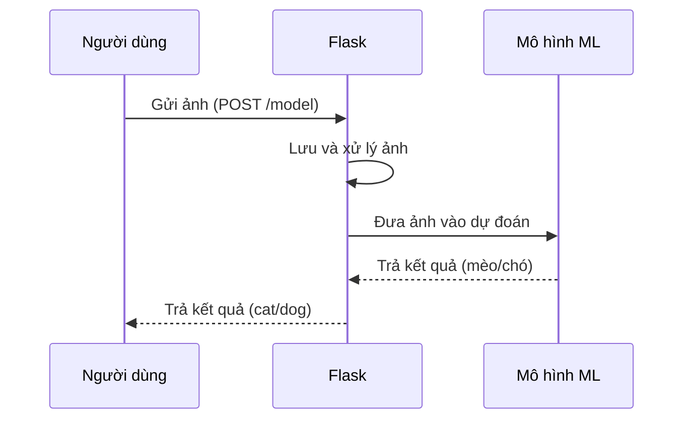

# Chapter 1: Ứng dụng Flask phục vụ dự đoán mèo/chó


## Động lực: Làm sao để máy tính biết đây là mèo hay chó?

Hãy tưởng tượng bạn có một bức ảnh và muốn hỏi máy tính: "Đây là mèo hay chó vậy?" Để làm được điều này, chúng ta cần một "quầy tiếp tân" thông minh, nơi bạn gửi ảnh lên, máy tính sẽ kiểm tra, xử lý và trả lời bạn ngay lập tức. Ứng dụng Flask chính là "quầy tiếp tân" đó trong dự án của chúng ta!

Trong chương này, bạn sẽ học cách ứng dụng Flask giúp nhận ảnh từ người dùng, xử lý và trả về kết quả dự đoán là mèo hay chó. Đây là bước đầu tiên để xây dựng một hệ thống dự đoán thông minh.

---

## 1. Ứng dụng Flask là gì?

**Flask** là một thư viện Python giúp bạn tạo ra các ứng dụng web một cách đơn giản. Bạn có thể tưởng tượng Flask giống như một nhân viên lễ tân, luôn sẵn sàng nhận yêu cầu (ví dụ: nhận ảnh), xử lý và trả lời lại cho bạn.

### Ví dụ thực tế

- Bạn gửi một bức ảnh lên web.
- Flask nhận ảnh, xử lý và hỏi mô hình học máy: "Đây là mèo hay chó?"
- Flask trả lại câu trả lời cho bạn.

---

## 2. Các thành phần chính của ứng dụng Flask dự đoán mèo/chó

Để hiểu rõ hơn, hãy cùng xem các thành phần chính của ứng dụng này:

- **Nhận ảnh từ người dùng:** Người dùng gửi ảnh lên qua web.
- **Lưu ảnh lại:** Ảnh được lưu tạm thời trên máy chủ.
- **Xử lý ảnh:** Ảnh được chỉnh lại kích thước cho phù hợp với mô hình.
- **Dự đoán:** Ảnh được đưa vào mô hình học máy để dự đoán.
- **Trả kết quả:** Kết quả (mèo hoặc chó) được trả về cho người dùng.

---

## 3. Cách sử dụng ứng dụng Flask để dự đoán mèo/chó

### Gửi ảnh lên và nhận kết quả

Giả sử bạn có một ảnh tên là `cat.jpg`. Bạn có thể gửi ảnh này lên ứng dụng Flask bằng cách sử dụng một công cụ như Postman hoặc lệnh `curl`:

```bash
curl -X POST -F "file=@cat.jpg" http://localhost:6040/model
```

**Kết quả trả về:**  
Nếu là mèo, bạn sẽ nhận được chữ `cat`.  
Nếu là chó, bạn sẽ nhận được chữ `dog`.

---

## 4. Giải thích từng phần mã nguồn

Chúng ta sẽ cùng xem qua từng phần quan trọng trong file `Docker/api.py`.

### a. Khởi tạo ứng dụng Flask

```python
from flask import Flask

app = Flask(__name__)
```
**Giải thích:**  
Dòng này tạo ra một ứng dụng Flask mới, giống như mở một quầy tiếp tân sẵn sàng phục vụ.

---

### b. Định nghĩa đường dẫn nhận ảnh

```python
@app.route('/model', methods=['POST'])
def index():
    # Xử lý yêu cầu ở đây
```
**Giải thích:**  
Khi bạn gửi ảnh lên địa chỉ `/model` bằng phương thức POST, hàm `index()` sẽ được gọi để xử lý.

---

### c. Nhận và lưu ảnh

```python
image = request.files['file']
path_to_save = os.path.join(app.config['UPLOAD_FOLDER'], image.filename)
image.save(path_to_save)
```
**Giải thích:**  
- Lấy file ảnh từ người dùng gửi lên.
- Lưu ảnh vào thư mục `static` trên máy chủ.

---

### d. Xử lý ảnh và dự đoán

```python
frame = cv2.imread(path_to_save)
frame = cv2.resize(frame, dsize=(150,150))
frame = np.expand_dims(frame, axis=0)
prediction_prob = model.predict(frame)[0][0]
```
**Giải thích:**  
- Đọc ảnh vừa lưu.
- Đổi kích thước ảnh về 150x150 pixel cho phù hợp với mô hình.
- Thêm một chiều để phù hợp với đầu vào của mô hình.
- Đưa ảnh vào mô hình để dự đoán xác suất.

---

### e. Trả kết quả cho người dùng

```python
if prediction_prob < 0.5:
    output = "cat"
else:
    output = "dog"
return output
```
**Giải thích:**  
- Nếu xác suất nhỏ hơn 0.5, dự đoán là mèo (`cat`).
- Nếu lớn hơn hoặc bằng 0.5, dự đoán là chó (`dog`).
- Trả kết quả về cho người dùng.

---

## 5. Ứng dụng Flask hoạt động như thế nào? (Minh họa bằng sơ đồ)

Hãy xem quy trình hoạt động của ứng dụng qua sơ đồ sau:



**Giải thích:**  
- Người dùng gửi ảnh lên.
- Flask nhận, lưu và xử lý ảnh.
- Flask đưa ảnh vào mô hình học máy để dự đoán.
- Mô hình trả về kết quả.
- Flask gửi kết quả lại cho người dùng.

---

## 6. Bên trong ứng dụng Flask: Chuyện gì xảy ra khi bạn gửi ảnh?

Khi bạn gửi một ảnh lên `/model`, các bước sau sẽ diễn ra:

1. **Nhận ảnh:** Flask lấy file ảnh từ yêu cầu.
2. **Lưu ảnh:** Ảnh được lưu vào thư mục tạm.
3. **Xử lý ảnh:** Ảnh được đổi kích thước cho phù hợp với mô hình.
4. **Dự đoán:** Ảnh được đưa vào mô hình học máy để dự đoán.
5. **Trả kết quả:** Kết quả (mèo/chó) được gửi lại cho bạn.

---

## 7. Một số lưu ý khi sử dụng ứng dụng Flask

- Ứng dụng chỉ nhận file ảnh gửi lên bằng phương thức POST.
- Nếu gửi sai định dạng hoặc không có file, ứng dụng sẽ báo lỗi.
- Kết quả trả về chỉ là chữ `cat` hoặc `dog`.

---

## 8. Tổng kết

Trong chương này, bạn đã hiểu cách ứng dụng Flask đóng vai trò là "quầy tiếp tân" nhận ảnh, xử lý và trả về kết quả dự đoán mèo/chó. Đây là bước đầu tiên để xây dựng một hệ thống dự đoán thông minh.

Ở chương tiếp theo, chúng ta sẽ tìm hiểu về trái tim của hệ thống dự đoán: mô hình học máy phân loại mèo/chó. Hãy cùng khám phá nhé!

👉 [Chương 2: Mô hình học máy phân loại mèo/chó](02_mô_hình_học_máy_phân_loại_mèo_chó_.md)

