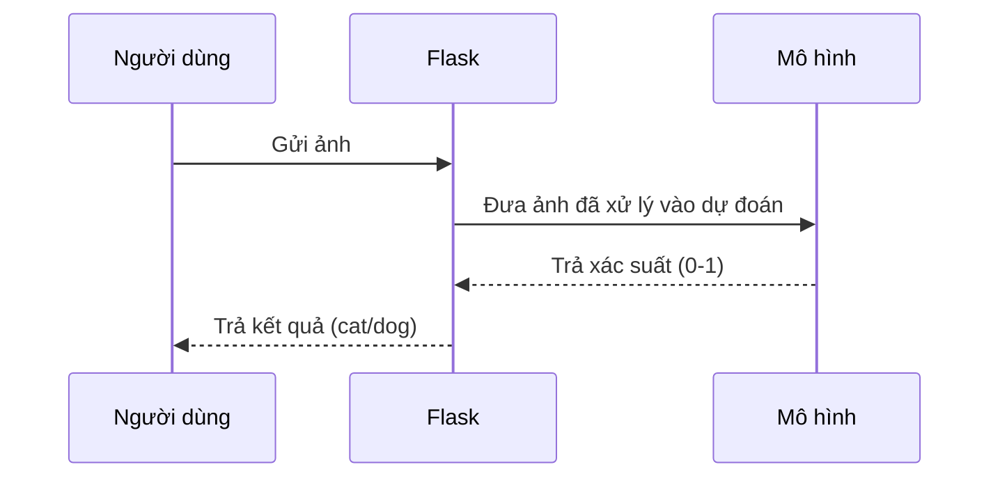

# Chapter 2: Mô hình học máy phân loại mèo/chó


---

## Chuyển tiếp từ chương trước

Ở [Chương 1: Ứng dụng Flask phục vụ dự đoán mèo/chó](01_ứng_dụng_flask_phục_vụ_dự_đoán_mèo_chó_.md), bạn đã biết cách gửi một bức ảnh lên ứng dụng Flask và nhận lại kết quả là "mèo" hay "chó". Nhưng bạn có bao giờ tự hỏi: **Làm sao máy tính biết được đâu là mèo, đâu là chó?**  
Câu trả lời nằm ở "bộ não" của hệ thống – **mô hình học máy phân loại mèo/chó** mà chúng ta sẽ tìm hiểu trong chương này!

---

## 1. Động lực: Máy tính phân biệt mèo và chó như thế nào?

Hãy tưởng tượng bạn đưa cho một bác sĩ thú y một bức ảnh và hỏi: "Đây là mèo hay chó?"  
Bác sĩ sẽ nhìn, phân tích các đặc điểm (tai, mũi, lông,...) rồi trả lời bạn.

Mô hình học máy cũng giống như một "bác sĩ thú y ảo" vậy! Nó đã được huấn luyện với hàng ngàn bức ảnh mèo và chó, để khi nhận được một bức ảnh mới, nó có thể **phán đoán** và trả lời bạn.

---

## 2. Mô hình học máy là gì?

### a. Khái niệm đơn giản

- **Mô hình học máy** là một chương trình máy tính được "dạy" để nhận biết các mẫu (pattern) trong dữ liệu.
- Trong dự án này, mô hình được huấn luyện để **phân biệt mèo và chó qua ảnh**.

### b. Mô hình hoạt động ra sao?

- Khi nhận một bức ảnh, mô hình sẽ **phân tích** các đặc điểm của ảnh.
- Sau đó, nó **tính toán xác suất** bức ảnh đó là mèo hay chó.
- Cuối cùng, nó **trả về kết quả**: "cat" hoặc "dog".

---

## 3. Mô hình được lưu trữ và sử dụng như thế nào?

### a. File mô hình

- Sau khi huấn luyện, mô hình được lưu lại thành file:  
  **`cat_dog_classifier.hdf5`**
- File này giống như "bộ não" đã học xong, sẵn sàng sử dụng.

### b. Nạp mô hình vào ứng dụng Flask

Khi ứng dụng Flask khởi động, nó sẽ **nạp** mô hình này để sử dụng cho việc dự đoán.

```python
from keras.models import load_model

model_file = "models/cat_dog_classifier.hdf5"
model = load_model(model_file)
```

**Giải thích:**  
- Dòng này sẽ tải mô hình đã huấn luyện từ file vào bộ nhớ, để sẵn sàng dự đoán.

---

## 4. Quy trình dự đoán: Từ ảnh đến kết quả

Hãy cùng xem mô hình hoạt động như thế nào khi nhận một bức ảnh:

### a. Các bước chính

1. **Nhận ảnh** từ người dùng (qua Flask).
2. **Xử lý ảnh**: Đưa ảnh về đúng kích thước, chuẩn hóa dữ liệu.
3. **Dự đoán**: Đưa ảnh vào mô hình để tính xác suất.
4. **Trả kết quả**: Chọn "cat" hoặc "dog" dựa vào xác suất.

### b. Ví dụ minh họa

Giả sử bạn gửi lên một bức ảnh tên `dog.jpg`.  
Mô hình sẽ trả về kết quả:

- Nếu xác suất là 0.8 → Kết quả: "dog"
- Nếu xác suất là 0.2 → Kết quả: "cat"

---

## 5. Phân tích từng bước trong mã nguồn

Chúng ta sẽ cùng xem từng phần quan trọng trong quá trình dự đoán.

### a. Đọc và xử lý ảnh

```python
frame = cv2.imread(path_to_save)
frame = cv2.resize(frame, dsize=(150,150))
frame = np.expand_dims(frame, axis=0)
```

**Giải thích:**  
- Đọc ảnh từ file vừa lưu.
- Đổi kích thước ảnh về 150x150 pixel (giống lúc huấn luyện).
- Thêm một chiều để phù hợp với đầu vào của mô hình.

### b. Đưa ảnh vào mô hình để dự đoán

```python
prediction_prob = model.predict(frame)[0][0]
```

**Giải thích:**  
- Đưa ảnh đã xử lý vào mô hình.
- Nhận về một giá trị xác suất (từ 0 đến 1).

### c. Xác định kết quả dự đoán

```python
if prediction_prob < 0.5:
    output = "cat"
else:
    output = "dog"
```

**Giải thích:**  
- Nếu xác suất nhỏ hơn 0.5 → dự đoán là mèo.
- Nếu lớn hơn hoặc bằng 0.5 → dự đoán là chó.

---

## 6. Mô hình hoạt động bên trong như thế nào?

### a. Quy trình tổng quát

Hãy hình dung quy trình như sau:



**Giải thích:**  
- Người dùng gửi ảnh lên.
- Flask xử lý ảnh rồi chuyển cho mô hình.
- Mô hình phân tích và trả về xác suất.
- Flask dựa vào xác suất để trả kết quả cho người dùng.

---

### b. Bên trong mô hình học máy

- Mô hình học máy thực chất là một mạng nơ-ron (neural network) đã được huấn luyện.
- Khi nhận ảnh, nó sẽ "soi" từng điểm ảnh, tìm các đặc điểm giống mèo hoặc chó.
- Dựa vào kinh nghiệm đã học, nó sẽ **phán đoán** và đưa ra xác suất.

---

## 7. Ví dụ thực tế: Dự đoán một bức ảnh

Giả sử bạn gửi ảnh `cat.jpg` lên hệ thống.

### a. Ảnh được xử lý

```python
frame = cv2.imread("static/cat.jpg")
frame = cv2.resize(frame, (150,150))
frame = np.expand_dims(frame, axis=0)
```

### b. Dự đoán

```python
prob = model.predict(frame)[0][0]
```

### c. Kết quả

```python
if prob < 0.5:
    print("cat")
else:
    print("dog")
```

**Kết quả:**  
Nếu ảnh là mèo, mô hình sẽ trả về "cat".  
Nếu ảnh là chó, mô hình sẽ trả về "dog".

---

## 8. Một số lưu ý khi sử dụng mô hình

- Ảnh đầu vào cần đúng kích thước (150x150 pixel).
- Mô hình chỉ phân biệt được hai loại: mèo và chó.
- Nếu ảnh không rõ nét hoặc bị mờ, kết quả có thể không chính xác.

---

## 9. Tổng kết

Qua chương này, bạn đã hiểu:

- Mô hình học máy là "bộ não" giúp phân biệt mèo và chó qua ảnh.
- Mô hình được huấn luyện, lưu thành file và nạp vào ứng dụng Flask để sử dụng.
- Khi nhận ảnh, mô hình sẽ phân tích và trả về xác suất, từ đó quyết định là mèo hay chó.

Ở chương tiếp theo, bạn sẽ học cách **đóng gói và triển khai toàn bộ hệ thống với Docker** để có thể chạy ở bất kỳ đâu một cách dễ dàng!

👉 [Chương 3: Hệ thống đóng gói và triển khai với Docker](03_hệ_thống_đóng_gói_và_triển_khai_với_docker_.md)

