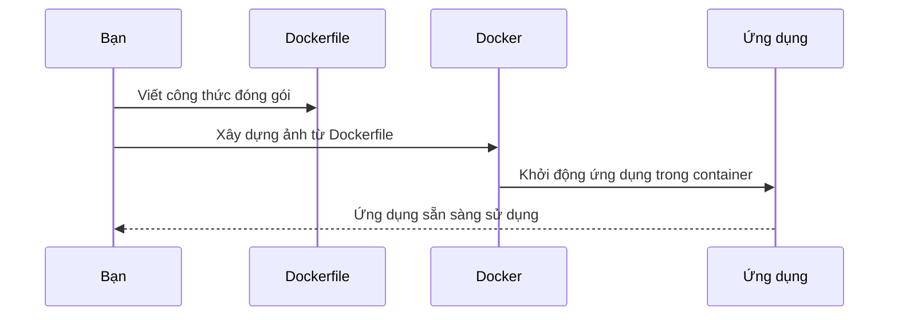
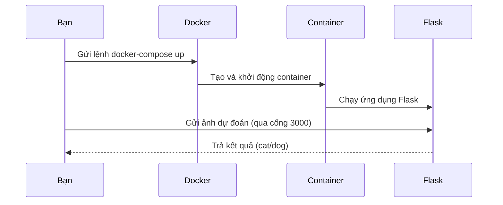

# Chapter 3: Hệ thống đóng gói và triển khai với Docker


---

## Chuyển tiếp từ chương trước

Ở [Chương 2: Mô hình học máy phân loại mèo/chó](02_mô_hình_học_máy_phân_loại_mèo_chó_.md), bạn đã hiểu cách mô hình học máy giúp phân biệt mèo và chó qua ảnh, cũng như cách ứng dụng Flask sử dụng mô hình này để trả kết quả cho người dùng. Tuy nhiên, làm sao để toàn bộ hệ thống này có thể chạy ổn định trên bất kỳ máy tính nào, mà không cần cài đặt phức tạp từng bước? Đó chính là lúc **Docker** xuất hiện như một “hộp thần kỳ” giúp bạn đóng gói và triển khai ứng dụng dễ dàng!

---

## 1. Động lực: Vì sao cần đóng gói và triển khai với Docker?

Hãy tưởng tượng bạn vừa nấu xong một món ăn ngon và muốn mang nó cho bạn bè ở xa thưởng thức. Nếu chỉ gửi nguyên liệu và hướng dẫn, chưa chắc ai cũng làm được giống bạn. Nhưng nếu bạn đóng gói sẵn món ăn vào một chiếc hộp, chỉ cần mở ra là ăn được, mọi chuyện sẽ đơn giản hơn rất nhiều!

**Docker** cũng giống như chiếc hộp đựng món ăn đó. Nó giúp bạn đóng gói toàn bộ ứng dụng, thư viện, cấu hình... vào một “container”. Nhờ vậy, dù bạn chạy trên máy tính cá nhân, máy chủ hay dịch vụ đám mây, chỉ cần mở hộp Docker là hệ thống hoạt động ngay, không lo thiếu thư viện hay lỗi môi trường.

---

## 2. Các khái niệm cơ bản về Docker

### a. Dockerfile – Công thức đóng gói

**Dockerfile** giống như một công thức nấu ăn chi tiết. Nó ghi lại từng bước để tạo ra “hộp” ứng dụng:

- Dùng hệ điều hành nào?
- Cài đặt những phần mềm, thư viện gì?
- Sao chép mã nguồn và mô hình vào đâu?
- Khi mở hộp thì chạy lệnh gì?

Ví dụ, một đoạn trong Dockerfile:

```dockerfile
FROM ubuntu:latest
WORKDIR /app
RUN apt-get update -y
```

**Giải thích:**  
- `FROM ubuntu:latest`: Bắt đầu từ hệ điều hành Ubuntu mới nhất.
- `WORKDIR /app`: Đặt thư mục làm việc là `/app`.
- `RUN apt-get update -y`: Cập nhật danh sách phần mềm.

---

### b. docker-compose.yaml – Quản lý nhiều dịch vụ

Nếu bạn muốn mở nhiều “hộp” cùng lúc (ví dụ: một hộp cho ứng dụng, một hộp cho cơ sở dữ liệu), **docker-compose.yaml** sẽ giúp bạn quản lý tất cả chỉ với một lệnh.

Ví dụ, đoạn cấu hình:

```yaml
services:
  Docker:
    image: demo
    ports:
      - 3000:6040
```

**Giải thích:**  
- Định nghĩa một dịch vụ tên là `Docker` sử dụng ảnh (image) tên `demo`.
- Mở cổng 6040 trong container ra cổng 3000 trên máy thật.

---

## 3. Quy trình đóng gói và triển khai ứng dụng với Docker

### a. Các bước tổng quát

1. **Viết Dockerfile**: Ghi lại cách xây dựng môi trường.
2. **Tạo docker-compose.yaml**: Quản lý các dịch vụ (nếu cần).
3. **Xây dựng ảnh Docker**: Đóng gói ứng dụng thành một “hộp”.
4. **Chạy container**: Mở “hộp” và sử dụng ứng dụng.

---

### b. Minh họa quy trình bằng sơ đồ



**Giải thích:**  
- Bạn viết Dockerfile để mô tả cách đóng gói.
- Docker dùng Dockerfile để tạo ra ảnh (image).
- Khi chạy, Docker mở container từ ảnh đó, khởi động ứng dụng.
- Ứng dụng hoạt động ổn định, bạn chỉ cần sử dụng mà không lo lỗi môi trường.

---

## 4. Phân tích từng phần trong Dockerfile và docker-compose.yaml

### a. Dockerfile – Đóng gói từng bước

**File:** `Docker/Dockerfile`

```dockerfile
FROM ubuntu:latest
WORKDIR /app
RUN apt-get update -y
RUN apt-get install -y python3-pip python3-dev build-essential hdf5-tools libgl1 libgtk2.0-dev
```

**Giải thích:**  
- Chọn hệ điều hành Ubuntu mới nhất.
- Đặt thư mục làm việc là `/app`.
- Cài đặt Python và các thư viện cần thiết cho mô hình học máy.

---

Tiếp theo:

```dockerfile
COPY ./requirements.txt /app/requirements.txt
RUN pip3 install -r requirements.txt
```

**Giải thích:**  
- Sao chép file `requirements.txt` (danh sách thư viện Python cần cài).
- Cài đặt các thư viện Python này bằng pip.

---

Cuối cùng:

```dockerfile
COPY . /app
EXPOSE 6040
CMD ["python3", "api.py"]
```

**Giải thích:**  
- Sao chép toàn bộ mã nguồn vào container.
- Mở cổng 6040 để ứng dụng Flask có thể nhận yêu cầu.
- Khi container khởi động, chạy lệnh `python3 api.py` để bật ứng dụng Flask.

---

### b. docker-compose.yaml – Quản lý dịch vụ

**File:** `docker-compose.yaml`

```yaml
version: "3.8"
services:
  Docker:
    image: demo
    container_name: demo_c
    ports:
      - 3000:6040
    working_dir: /app
    volumes:
      - ./Docker:/app
```

**Giải thích:**  
- Định nghĩa một dịch vụ tên `Docker` sử dụng ảnh `demo`.
- Đặt tên container là `demo_c`.
- Mở cổng 6040 trong container ra cổng 3000 trên máy thật (bạn sẽ truy cập ứng dụng qua `localhost:3000`).
- Đặt thư mục làm việc là `/app`.
- Gắn thư mục mã nguồn từ máy thật vào container để dễ phát triển.

---

## 5. Hướng dẫn từng bước đóng gói và chạy ứng dụng với Docker

### Bước 1: Xây dựng ảnh Docker

Mở terminal, di chuyển vào thư mục chứa Dockerfile, chạy lệnh:

```bash
docker build -t demo .
```

**Giải thích:**  
- `docker build`: Xây dựng ảnh Docker.
- `-t demo`: Đặt tên ảnh là `demo`.
- `.`: Sử dụng Dockerfile trong thư mục hiện tại.

---

### Bước 2: Khởi động container bằng docker-compose

Chạy lệnh:

```bash
docker-compose up
```

**Giải thích:**  
- Docker sẽ đọc file `docker-compose.yaml` và khởi động dịch vụ đã định nghĩa.
- Ứng dụng Flask sẽ chạy trong container, sẵn sàng nhận yêu cầu dự đoán mèo/chó.

---

### Bước 3: Gửi ảnh lên để dự đoán

Giống như ở [Chương 1: Ứng dụng Flask phục vụ dự đoán mèo/chó](01_ứng_dụng_flask_phục_vụ_dự_đoán_mèo_chó_.md), bạn có thể gửi ảnh bằng lệnh:

```bash
curl -X POST -F "file=@cat.jpg" http://localhost:3000/model
```

**Kết quả:**  
- Nếu là mèo, nhận về chữ `cat`.
- Nếu là chó, nhận về chữ `dog`.

---

## 6. Bên trong Docker: Chuyện gì xảy ra khi bạn chạy ứng dụng?

Khi bạn chạy `docker-compose up`, các bước sau sẽ diễn ra:

1. Docker đọc Dockerfile, tạo ra một ảnh (image) chứa toàn bộ ứng dụng và môi trường.
2. Docker mở một container từ ảnh đó, giống như mở một “hộp” đã đóng gói sẵn.
3. Ứng dụng Flask được khởi động bên trong container.
4. Bạn gửi ảnh lên qua cổng 3000, Docker chuyển tiếp vào cổng 6040 bên trong container.
5. Ứng dụng xử lý và trả kết quả về cho bạn.

---

### Sơ đồ quy trình bên trong Docker



---

## 7. Một số lưu ý khi sử dụng Docker

- **Không cần cài đặt thủ công:** Tất cả thư viện, mô hình, mã nguồn đều đã được đóng gói sẵn.
- **Dễ dàng chia sẻ:** Chỉ cần gửi Dockerfile và docker-compose.yaml, ai cũng có thể chạy ứng dụng giống bạn.
- **Tái sử dụng và mở rộng:** Có thể thêm nhiều dịch vụ khác (ví dụ: cơ sở dữ liệu) vào docker-compose.yaml nếu cần.
- **Kiểm soát môi trường:** Ứng dụng luôn chạy trong môi trường giống nhau, tránh lỗi do khác biệt hệ điều hành.

---

## 8. Tổng kết

Qua chương này, bạn đã học cách sử dụng Docker để đóng gói và triển khai toàn bộ hệ thống dự đoán mèo/chó. Nhờ Docker, việc chia sẻ và chạy ứng dụng trở nên cực kỳ đơn giản, giống như gửi một món ăn đã đóng hộp – chỉ cần mở ra là dùng được ngay!

Bạn đã hoàn thành các bước cơ bản để xây dựng một hệ thống dự đoán thông minh, từ mô hình học máy, ứng dụng Flask, đến đóng gói và triển khai với Docker. Hãy thử tự tay thực hiện các bước này để cảm nhận sự tiện lợi mà Docker mang lại nhé!

---

Chúc mừng bạn đã hoàn thành toàn bộ hướng dẫn cơ bản về dự án DemoDocker! Nếu muốn mở rộng hoặc tìm hiểu sâu hơn, bạn có thể tiếp tục khám phá các chủ đề nâng cao về Docker, học máy hoặc phát triển ứng dụng web.

---

**Cảm ơn bạn đã đồng hành cùng khóa học!**

