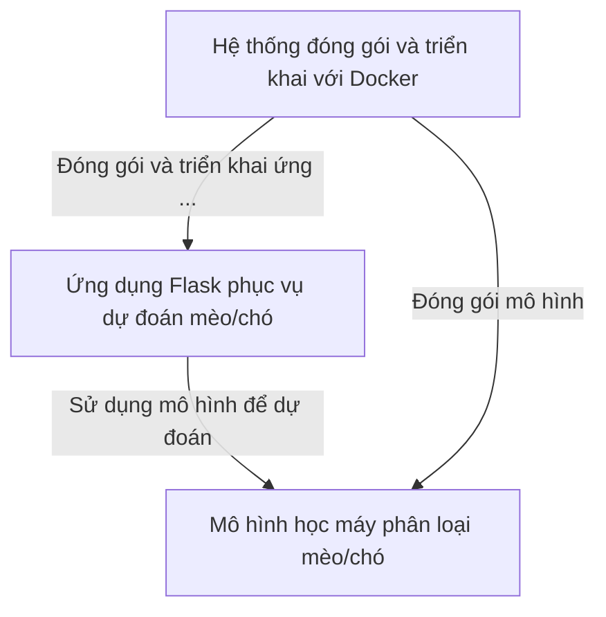

# Documentation: DemoDocker

**DemoDocker** là một dự án thử nghiệm giúp bạn dễ dàng dự đoán hình ảnh là *mèo* hay *chó* thông qua một ứng dụng web đơn giản sử dụng **Flask**. Ứng dụng này nhận ảnh từ người dùng, xử lý và sử dụng *mô hình học máy* đã huấn luyện để phân loại. Toàn bộ hệ thống được **đóng gói bằng Docker**, giúp triển khai nhanh chóng và chạy ổn định trên mọi máy tính mà không cần cài đặt phức tạp.

## Chapters

1. [Ứng dụng Flask phục vụ dự đoán mèo/chó
](01_ứng_dụng_flask_phục_vụ_dự_đoán_mèo_chó_.md)
2. [Mô hình học máy phân loại mèo/chó
](02_mô_hình_học_máy_phân_loại_mèo_chó_.md)
3. [Hệ thống đóng gói và triển khai với Docker
](03_hệ_thống_đóng_gói_và_triển_khai_với_docker_.md)
